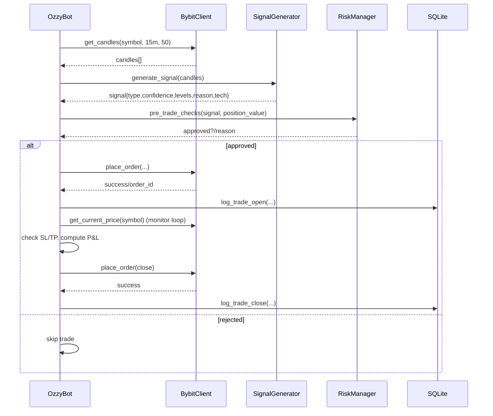

# Ozzy Simple — System Architecture Overview

Generated: 2025-10-11

This document explains how the trading system works end-to-end so you can research, validate, and evolve it as a whole.

## High-level components

- Config and runtime modes
  - `config.py`: Central parameters (paper vs live, RSI/EMA thresholds, MIN_CONFIDENCE, trading hours, risk limits, symbols).
  - Paper vs Live: Paper routes orders through in-memory simulation in `BybitClient`; live would POST to Bybit’s REST API.
- Exchange client — `bybit_client.py`
  - Market data: candles, tickers, orderbook; robust mid-price with fallbacks.
  - Paper trading engine: simulates LONG and SHORT open/close, margin for shorts, balance tracking.
- Strategy — `signal_generator.py`
  - Features: RSI(14), EMA(9/21 by default), volume ratio, momentum, ATR%, stddev of returns, optional bid/ask spread.
  - Rules: RSI extremes + EMA regime + volume; momentum overrides; confidence score; HOLD-to-trade fallback if confidence ≥ MIN_CONFIDENCE.
- Orchestrator — `main.py` (class `OzzyBot`)
  - Loop: per symbol → fetch candles → generate signal → risk checks → place order → monitor & close → persist logs and DB.
  - A/B time filter via `TimeFilterWrapper` (e.g., avoid 22:00–02:00 for test group tagging).
- Risk — `risk_manager.py`
  - Position sizing from RISK_PER_TRADE, confidence-weighted scaler, capital caps, trading-hours, daily loss limit, max positions.
  - Tracks session capital, daily P&L, open positions; reads DB for all-time stats.
- Persistence — `db.py`
  - SQLite schema for `signals`, `trades`, `positions`; simple synchronous helpers (insert/open/close/log).
- Monitoring and analytics
  - `dashboard.py` (Streamlit): equity curve, KPIs, recents, best/worst, win rate by confidence.
  - `scripts/watch_trades.py`, `scripts/simple_log_watch.py`: terminal monitors.
  - `analytics.py`: Sharpe, MDD, buckets, best/worst hours, durations, risk-reward.
  - `scripts/generate_project_report.py`: comprehensive Markdown report (`PROJECT_REPORT.md`).
- Optimization
  - `scripts/ai_optimizer_emergency.py`: Optuna search for RSI/EMA/thresholds and trading hours; writes `config_ai_optimized.py`.
  - `scripts/analyze_ai_performance.py`: compares pre-AI vs post-AI.
  - `turbo_mode.py`: synthetic trade generation to accelerate ablations and A/Bs (via `scripts/simulate_end_to_end.py`, if present).

## Component diagram

```mermaid
flowchart LR
  subgraph Config
    C[config.py]
  end

  subgraph Core
    M[main.py (OzzyBot)]
    SG[signal_generator.py]
    RM[risk_manager.py]
    EX[bybit_client.py]
    DB[(SQLite ozzy_simple.db)]
    PT[positions.json]
  end

  subgraph Monitoring
    DASH[dashboard.py]
    ANALYTICS[analytics.py]
    WATCH[scripts/watch_trades.py]
    REPORT[scripts/generate_project_report.py]
  end

  C --> M
  M --> SG
  M --> RM
  M <--> EX
  M --> DB
  M --> PT
  SG -->|log| DB
  RM -->|read stats| DB
  DASH --> DB
  ANALYTICS -->|trades.csv| M
  REPORT --> DB
```

## Trade lifecycle (sequence)



## Data model (SQLite)

- signals
  - id, timestamp, symbol, signal, confidence, quality, rsi, ema_short, ema_long, volume_ratio, momentum, hour, day_of_week, atr_pct, stddev_returns_pct, reason
- trades
  - id, entry_timestamp, exit_timestamp, symbol, side, entry_price, exit_price, position_size, position_value, pnl, duration_seconds, quality, confidence, entry_reason, exit_reason
- positions (snapshots)
  - id, timestamp, symbol, side, qty, entry_price, unrealized_pnl

Notes:

- `log_trade_open` inserts a row with NULL exit fields; `log_trade_close` updates by id.
- CSV mirrors exist: `trades.csv` (completed), `signals.csv` (all signals) for quick analysis/ML.

## Contracts and key APIs

- SignalGenerator.generate_signal(candles)
  - Input: array of dicts with open/high/low/close/volume
  - Output: dict with
    - signal: LONG|SHORT|HOLD
    - confidence: 0–100, quality: PREMIUM|GOOD|MODERATE|POOR
    - entry_price, stop_loss, take_profit (floats)
    - technical_data: rsi, ema_short, ema_long, ema_signal, volume_ratio, price_momentum, atr, atr_pct, stddev_returns_pct
    - reason: str, timestamp: str
  - Error modes: if <30 candles, returns HOLD with reason
- RiskManager.pre_trade_checks(signal, position_value)
  - Enforces: trading hours, daily loss limit, max positions, min confidence, capital sufficiency
  - Returns: (bool approved, str reason)
- BybitClient.get_current_price(symbol)
  - Returns mid-price from orderbook or 1m candle close or ticker last; None on failure
- BybitClient.place_order(...)
  - Paper: simulates LONG/SHORT with margin for short; returns {success, order_id, price}
  - Live: would POST to Bybit v5 endpoints (wired but requires real keys)
- DB helpers: log_signal, log_trade_open -> id, log_trade_close(id, ...)

## Configuration summary

From `config.py` (AI-optimized snapshot):

- Trading mode: PAPER_TRADING=True; TESTNET enabled in client
- Signals: RSI_OVERSOLD=39, RSI_OVERBOUGHT=67; EMA_SHORT=13, EMA_LONG=23; MIN_CONFIDENCE=41.1
- Hours: 10:00–21:00 Africa/Johannesburg
- Risk: LEVERAGE=1.0; POSITION_SIZE_PERCENTAGE=2.0; STOP_LOSS_PERCENTAGE=3%; TAKE_PROFIT_PERCENTAGE=6%; MAX_OPEN_POSITIONS=3; DAILY_LOSS_LIMIT=R500
- Symbols: BTCUSDT, ETHUSDT, BNBUSDT, XRPUSDT, SOLUSDT

Note: Some runtime files reference names like STARTING_CAPITAL, MAX_POSITIONS, CHECK_INTERVAL_MINUTES. Aligning names across config and consumers is recommended (see “Gaps and alignment”).

## Monitoring and reporting

- Live dashboard: `dashboard.py` (Streamlit)
- Terminal UIs: `scripts/watch_trades.py`, `scripts/simple_log_watch.py`
- Analytics & reports: `analytics.py`, `PROJECT_REPORT.md` generator

## A/B testing and optimization

- Time-of-day A/B via `TimeFilterWrapper` in main loop (tagged in entry_reason and signal records)
- Optuna optimizer (`scripts/ai_optimizer_emergency.py`) for parameter search; writes `config_ai_optimized.py`
- Post-cutover analysis via `scripts/analyze_ai_performance.py`
- Synthetic trade generator via `turbo_mode.py` to accelerate data gathering and ablations

## Gaps and alignment checklist

- Naming consistency: Ensure config exposes the exact names used by `main.py` and `risk_manager.py` (e.g., STARTING_CAPITAL vs INITIAL_BALANCE; MAX_POSITIONS vs MAX_OPEN_POSITIONS; STOP_LOSS_PERCENT vs STOP_LOSS_PERCENTAGE; TAKE_PROFIT_PERCENT vs TAKE_PROFIT_PERCENTAGE; TRADING_SYMBOLS vs SYMBOLS; CHECK_INTERVAL_MINUTES, CLOSE_POSITIONS_EOD).
- Schema joins: Dashboard confidence buckets currently JOIN trades to signals on symbol only; consider joining on closest timestamp to avoid mismatches.
- Spread/slippage: Signal has optional bid/ask spread metrics; incorporate into risk sizing or filters if spreads widen.
- Short handling: Paper engine supports shorts with margin; ensure risk rules account for short-specific exposure.
- State durability: `positions.json` is updated periodically; consider persisting open positions to DB for recoverability.

## How to run (quick)

- Bot (paper):
  - Start: main entrypoint in `main.py` (reads `config.py`)
- Live dashboard:
  - `streamlit run dashboard.py`
- Comprehensive report:
  - `python scripts/generate_project_report.py` (writes `PROJECT_REPORT.md`)

---

Use this doc as the system-level map for deeper research and targeted experiments (see `RESEARCH_PLAN.md`).
